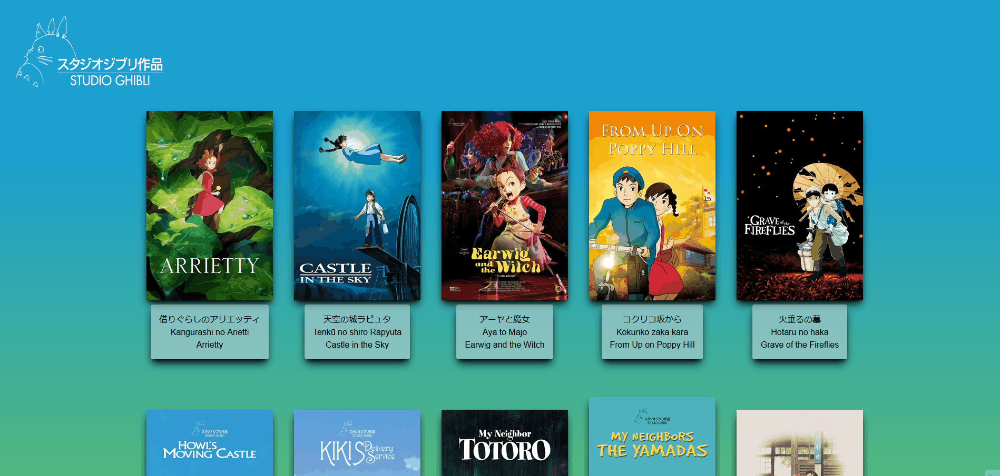
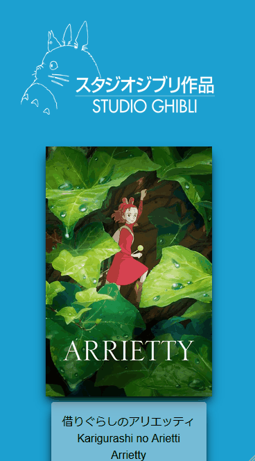

# 🎬 Studio Ghibli API

_Read this in English: [🇺🇸 English](README.md)_

## 📝 Descrição do Projeto

Este projeto é uma aplicação em React + TypeScript que consome a API pública do **Studio Ghibli** para exibir um catálogo moderno e interativo de filmes. A aplicação mostra os 10 primeiros filmes em ordem alfabética e permite ao usuário visualizar os detalhes completos de cada um.

O objetivo é praticar e aplicar conceitos como **componentes React**, **estado**, **roteamento**, **estilização com Tailwind**, **consumo de API** e **tipagem com TypeScript**.

## 🎨 Imagens do projeto

<div align="center">
   <div align="center">
    
   <br><br>
    <br>
   </div>
</div>

## 🔎 Funcionalidades

- Interface responsiva para desktop e mobile
- Busca de dados na API oficial do Ghibli
- Ordenação alfabética dos filmes por título
- Cartões de filmes na página inicial
- Página dinâmica de detalhes para cada filme
- Componente de carregamento reutilizável durante a busca dos dados
- Funções de serviço reutilizáveis para listagem e detalhe dos filmes
- Navegação com React Router usando parâmetros na URL
- Estrutura tipada com TypeScript
- Estilo com Tailwind CSS
- Navegação de volta para a home na página de detalhes

## 🛠️ Tecnologias Utilizadas

- **React:** Biblioteca para construção de componentes
- **TypeScript:** Tipagem estática para JavaScript
- **Vite:** Ferramenta de build e servidor de desenvolvimento
- **React Router DOM:** Navegação do lado do cliente
- **Tailwind CSS:** Framework CSS baseado em utilidades
- **Fetch API:** Requisições HTTP para consumir a API
- **Git:** Controle de versão

## 💡 Decisões do Projeto

1. **Organização de componentes**
   - Foram criados componentes dedicados para estrutura e reutilização, como `Header`, `Footer`, `Layout` e `Loading`
   - Cada parte tem uma responsabilidade clara para facilitar manutenção

2. **Gerenciamento de estado**
   - O hook `useState` é utilizado para controlar os dados da lista e do detalhe
   - O estado de carregamento é usado para exibir um indicador enquanto a API responde

3. **Tratamento de Requisições à API**
   - Utilizado hook `useEffect` para buscar dados quando o componente é montado
   - Implementado tratamento de erros com blocos `try-catch`
   - Adicionado `.finally()` para garantir que o estado de carregamento sempre seja atualizado
   - Funções reutilizáveis foram extraídas para `src/services/movies.ts`
   - Isso evita repetir a lógica de `fetch` em mais de uma página

4. **Reuso da lógica de API**
   - `getMovies()` busca a listagem completa
   - `getMovieById(id)` busca um filme específico pelo ID
   - As duas funções são reaproveitadas nas páginas Home e FilmDetail

5. **Segurança de tipos**
   - Um tipo `Movie` define a estrutura da resposta da API
   - Isso reduz erros em execução e melhora a produtividade no desenvolvimento

6. **Roteamento**
   - Rotas dinâmicas são tratadas com `useParams()`
   - A navegação é feita com `Link` do React Router

## 📁 Estrutura do Projeto

```bash
studio-ghibli-api/
├── src/
│   ├── assets/
│   │   ├── catbus-loading.gif
│   │   ├── studio-ghibli.png
│   │   └── studio-shibli-logo-secondary.png
│   │
│   ├── components/
│   │   ├── Footer/
│   │   │   └── index.tsx
│   │   ├── Header/
│   │   │   └── index.tsx
│   │   ├── Layout/
│   │   │   └── index.tsx
│   │   └── Loading/
│   │       └── loading.tsx
│   │
│   ├── pages/
│   │   ├── FilmDetail/
│   │   │   └── index.tsx
│   │   └── Home/
│   │       └── index.tsx
│   │
│   ├── routes/
│   │   └── index.tsx
│   ├── services/
│   │   └── movies.ts
│   ├── styles/
│   │   └── globals.css
│   ├── types/
│   │   └── movie.ts
│   ├── App.tsx
│   ├── main.tsx
│   └── vite-env.d.ts
│
├── index.html
├── package.json
├── tsconfig.json
├── tsconfig.app.json
├── tsconfig.node.json
├── vite.config.ts
├── README.md
├── README.pt-br.md
└── .gitignore
```

### Finalidade das pastas

- `src/assets/` — imagens e mídias estáticas utilizadas no app
- `src/components/` — blocos reutilizáveis da interface, como cabeçalho, rodapé, layout e loading
- `src/pages/` — telas da aplicação, como Home e FilmDetail
- `src/routes/` — configuração das rotas da aplicação
- `src/services/` — lógica reutilizável de acesso à API
- `src/styles/` — estilos globais da aplicação
- `src/types/` — tipos e interfaces TypeScript

## 🎯 Fluxo principal da aplicação

- `Home` carrega a lista de filmes da API
- a lista é ordenada alfabeticamente e limitada aos 10 primeiros
- cada card leva para `/film/:id`
- `FilmDetail` busca o filme selecionado pelo ID e exibe os detalhes
- enquanto a requisição está em andamento, o componente `Loading` aparece na tela

## 💭 Melhorias futuras

- Adicionar busca e filtros
- Adicionar opções de ordenação por ano ou nota
- Implementar favoritos com `localStorage`
- Adicionar animações entre páginas
- Criar seções mais detalhadas sobre cada filme
- Melhorar acessibilidade e SEO
- Adicionar testes para componentes e fluxo de API

## 📌 Observação

Este projeto é um exemplo prático de como combinar React, TypeScript, consumo de API e interface baseada em rotas em uma aplicação frontend simples e completa.

## 🚀 Como Executar o Projeto

Siga os passos abaixo para executar o projeto em sua máquina:

### Pré-requisitos

- **Node.js** (versão 14 ou superior)
- **npm** ou **yarn** gerenciador de pacotes
- **Git** para clonar o repositório

### Passos de Instalação

1. **Clonar o repositório:**

   ```bash
   git clone https://github.com/cezarviana/studio-ghibli-api.git
   cd studio-ghibli-api
   ```

2. **Instalar dependências:**

   ```bash
   npm install
   ```

3. **Instala o React-Router-Dom:**

   ```bash
   npm run dev
   ```

4. **Iniciar o servidor de desenvolvimento:**

   ```bash
   npm run dev
   ```

5. **Abrir no navegador:**
   - A aplicação estará disponível em `http://localhost:5173` (ou a URL mostrada no terminal)
   - Abra a URL em seu navegador web

### Scripts Disponíveis

- `npm run dev` - Iniciar servidor de desenvolvimento
- `npm run build` - Construir para produção
- `npm run preview` - Visualizar build de produção localmente
- `npm run lint` - Executar ESLint (se configurado)
